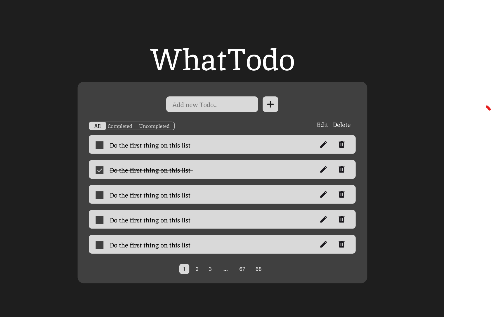
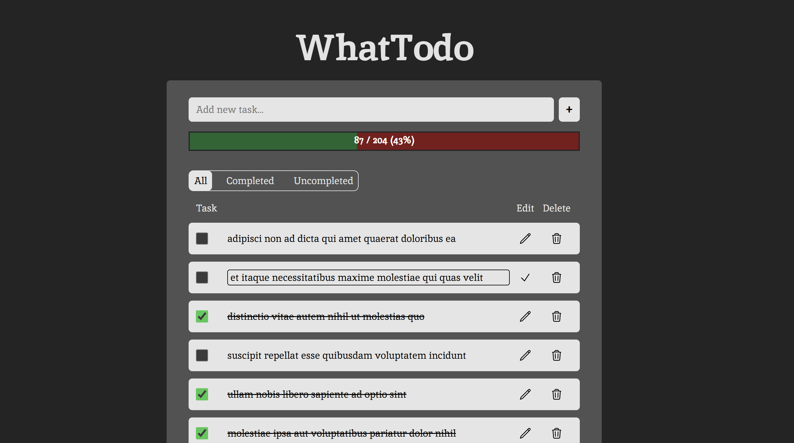
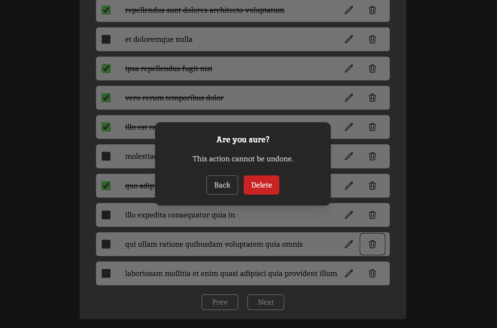

# WhatTodo

## Description
Simple, responsive frontend todo application build with Vue 3, Typescript and Pinia for state management.

### Features

- Displays tasks fetched from API using Axios or loaded from LocalStorage
- Users can add new tasks to list, delete or edit existing tasks and toggle their completion status
- Filters task depending on selected category (All/Completed/Uncompleted)
- Implements pagination for better clarity
- Display statistics of completed tasks
- Handles user errors, validates inputs and prevents actions out of bounds
- Displays a modal for confirmation of deletion to prevent accidental deletion
- Implements keyboard shortcuts like double-click, Enter and Esc for faster editing
- Shows loading icon during API calls

---

## Technologies used

- **Vue 3** - frontend framework
- **TypeScript** - better type safety
- **Vite** - build tool and development server
- **Pinia** - state management
- **Axios** - API communication
- **TailwindCSS** - styling 
- **Docker and Docker Compose** - containerization, portability
- **Node.js** (developed with v22.14.0)

---

---

## Setup Instructions

You can view the app through GithubPages here: [WhatTodo](https://vikii712.github.io/todo-list/)


Or you can choose between  [Node](#option-1-local-development-with-npm) and [Docker](#option-2-docker-deployment) setup.


---

### Option 1: Local run with npm

#### Prerequisites
- **Node.js** ( developed with v22.14.0)
- **npm**

#### Step 1: Clone the Repository
```bash
git clone https://github.com/Vikii712/todo-list.git
cd what-todo
```

#### Step 2: Install Dependencies
```bash
npm install
```

#### Step 3: Run Development Server
```bash
npm run dev
```

The application will be available at **http://localhost:5173**

---

### Option 2: Docker Deployment

#### Prerequisites
- **Docker** and **Docker Compose**


#### Step 1: Clone the Repository
```bash
git clone https://github.com/Vikii712/todo-list.git
cd what-todo
```

#### Step 2: Build and Start the Application
```bash
docker-compose up --build
```

The application will be available at **http://localhost:8080**

---

---

## Project Structure

```
what-todo/
│
├── src/
│   ├── components/        # All reusable components
│   │   └── main/          # Components for the main layout 
│   │       └── list/      # Components related to task list
│   │
│   ├── stores/            # Pinia state management
│   ├── App.vue            # Root component
│   └── main.ts            # Application entry point
│
├── public/
│   └── robots.txt         # SEO configuration
│
├── index.html             # Main HTML template
├── Dockerfile             # Docker image definition
├── docker-compose.yml     # Docker services configuration
├── package.json           # Dependencies and scripts
└── README.md              
```

---

## Design decisions and trade-offs

### Technologies related:
- used Figma for a quick sketch of template to save time and speed up development decisions
- used TypeScript for better type safety and early error prevention
- chose TailwindCSS for faster UI styling while still allowing wide customization
- dockerized the app for portability (can run on any machine)
- used vite preview for preview - not optimal for real production

### App features related:
- created Prev and Next buttons (numbered pagination would be better but harder to implement from scratch in tailwind)
- if all the tasks in current page are deleted, the user is automatically redirected on previous page (if not on page 1)
- keyboard shortcuts - double click for edit, Enter to save, Esc to cancel edit while still having buttons and labels for non-familiar users 
- confirmation modal for deletion to prevent accidental delete

## Future improvements
- add user profiles and authentification (data from API had UserId)
- use a real database for storing tasks and profiles
- better pagination - with numbers (more accessible, easier to see progress)
- soft delete for the option of restoring deleted tasks
- accessibility menu / better accessibility optimization 
- add task deadlines, progress bars for partially completed tasks or tasks in-progress
- reordering tasks, maybe with drag-and-drop or up/down arrows

---

## Quick wireframe from Figma:


## Screenshot from my application WhatTodo in Vue


